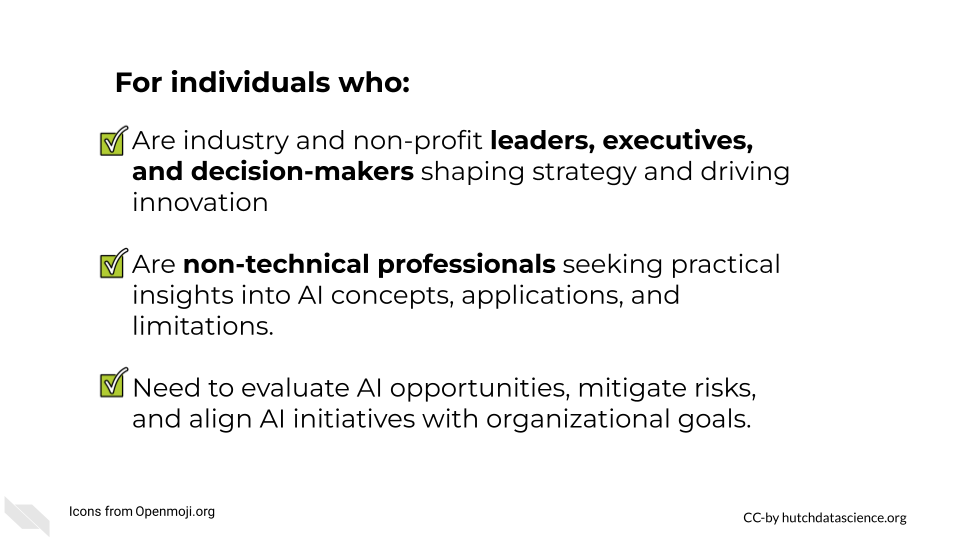
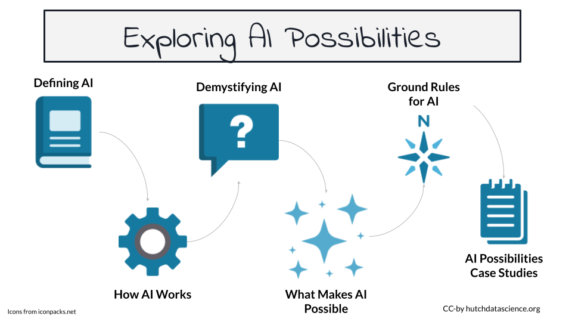
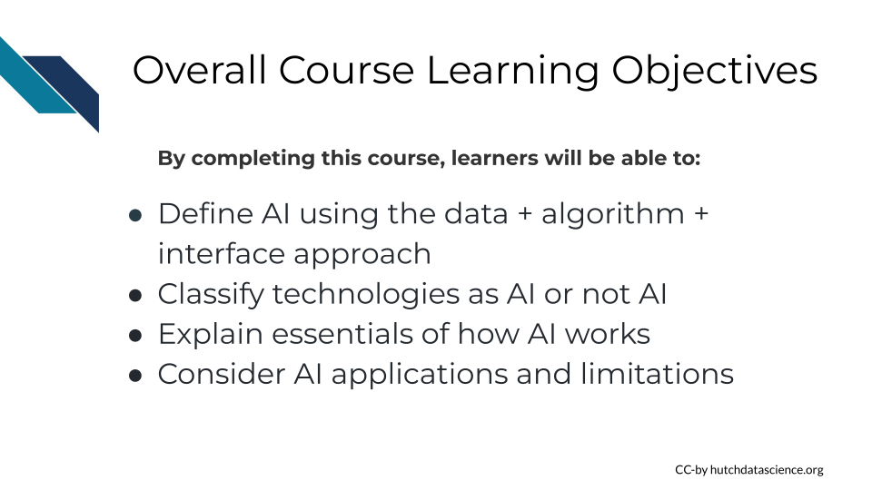

# (PART\*) Exploring AI Possibilities {-}

# Introduction to Exploring AI Possibilities

## Introduction

This course aims to help decision makers and leaders understand artificial intelligence (AI) at a strategic level. Not everyone will write an AI algorithm, and that is okay! Our rapidly evolving AI landscape means that we need executives and managers who know the essential information to make informed decisions and use AI for good. This course specifically focuses on the essentials of what AI is and what it makes possible, to better harmonize expectations and reality in the workplace.

## Motivation

This course will help you with your understanding of AI, helping you make strategic decision and cultivate a business environment that embraces the benefits of AI, while understanding its limitations and risks.

## Target Audience

This course is targeted toward industry and non-profit leaders and decision makers.

## Curriculum

In this course, we'll learn about what Artificial intelligence is, and what it isn't. We'll also learn the basics of how it works, and learn about different types of AI.

This course will cover:

- Framework, or definition, of AI
- Essential AI examples and case studies
- The take-home of how AI works
- Key definitions of types of AI and related technologies
- What is possible with AI

## Learning Objectives

We will learn how to:

- Determine what AI is and isn't using our three part framework: the data, algorithm, and interface
- Identify common technologies and whether or not they are AI
- Explain the essential "behind the scenes" technology of how AI works
- Identify possibilities for using AI while understanding its limitations

 

**Disclaimer:** The thoughts and ideas presented in this course are not to be substituted for legal or ethical advice and are only meant to give you a starting point for gathering information about AI policy and regulations to consider.

<!-- # VIDEO Introduction to Exploring AI Possibilities {.unlisted .unnumbered} -->

<!-- You can find the Google Slides for this video [here](https://docs.google.com/presentation/d/1M6lqJoN0yQDPJtO8nGWYrb7pI6kNv3uZeKcB8y5iPok/edit?usp=sharing). -->
