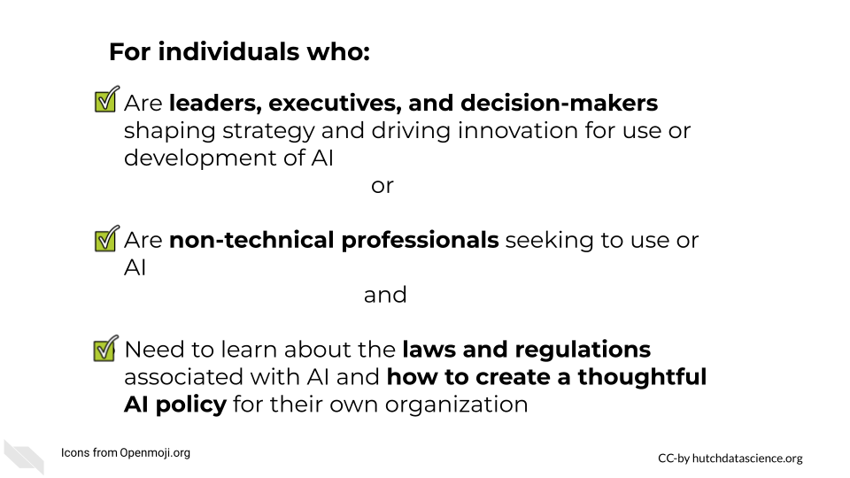
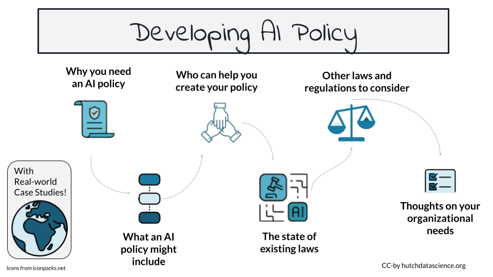

# (PART\*) Developing AI Policy {-}


# Introduction to Developing AI Policy

This course is intended to equip you with the knowledge you need to develop an effective AI policy for your organization.

## Motivation

AI tools are already changing how we work, and they will continue to do so for years. Over the next few years, we're likely going to see AI used in ways we've never imagined and are not anticipating. This course empowers you to make informed decisions and confidently create an AI policy that matches your organizational goals.

## Target Audience  

This course is targeted toward industry and non-profit leaders and decision makers.




## Curriculum  

In this course, you’ll learn why you need an AI policy, what an AI policy might include, who can help you create and develop a policy, the state of existing AI laws, other laws and regulations that can apply to AI systems and products, and considerations for creating a strong AI policy for your organization.





## Learning Objectives
<!--```{r learning_objectives, echo=FALSE, fig.alt='Overall Course Learning Objectives. By completing this course, learners will be able to: Understand the reasons why organizations need an AI policy. Identify the key elements of a good AI policy. Describe the roles and responsibilities of different team members involved. Identify key regulations outlined in the EU AI Act. Understand how existing industry-specific AI policies can inform your policy. Identify key legal categories relevant to AI use, including intellectual property, data privacy, and liability. Understand the limitations of relying solely on an AI policy without supporting infrastructure. Recognize the importance of involving diverse stakeholders AI policy creation. Identify strategies for building adaptable AI policies, such as living documents and separate best practices guidelines. Appreciate the role of effective training in promoting policy compliance.', out.width = '100%', warning=FALSE}
ottrpal::include_slide("https://docs.google.com/presentation/d/1w5PkqNeYlkUik4uXw30Opnzm9o-G_YQdOdjffNXlIA4/edit?slide=id.g34ec0b7ad13_0_161#slide=id.g34ec0b7ad13_0_161")
```-->

During this course, learners will:

- Understand the reasons why organizations need an AI policy.
- Identify the key elements of a good AI policy.
- Describe the roles and responsibilities of different team members involved in guiding AI use.
- Identify key regulations outlined in the EU AI Act, including risk classifications, transparency requirements, and prohibited applications.
- Understand how existing industry-specific AI policies can inform your organization's policy.
- Identify key legal categories relevant to AI use, including intellectual property, data privacy, and liability.
- Understand the limitations of relying solely on an AI policy without supporting infrastructure and training.
- Recognize the importance of involving diverse stakeholders from various departments in AI policy creation.
- Identify strategies for building flexible and adaptable AI policies, such as living documents and separate best practices guidelines.
- Appreciate the role of effective training in promoting policy compliance and ethical AI use.

<div class = disclaimer>
**Disclaimer:** The thoughts and ideas presented in this course are not to be substituted for legal or ethical advice and are only meant to give you a starting point for gathering information about AI policy and regulations to consider.
</div>
