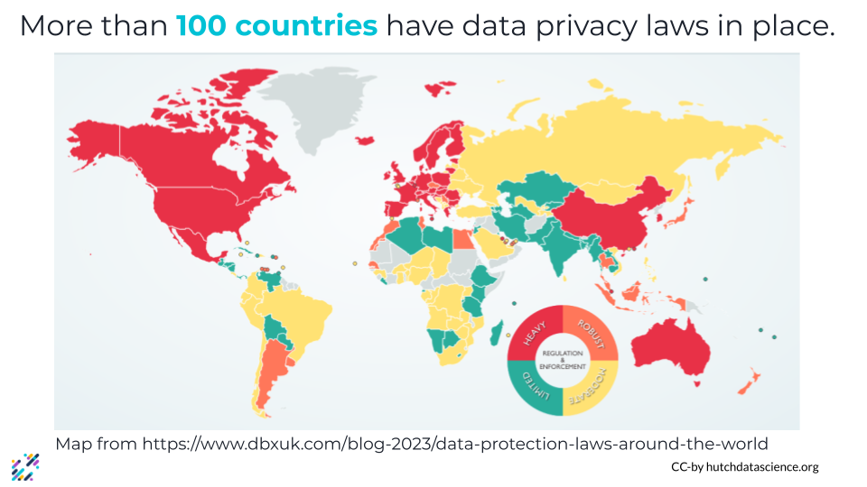

# Other laws to consider

While countries and jurisdictions are developing ans passing laws that specifically deal with AI, there are also existing laws around data that should be considered when creating an AI policy. Which ones you should consider will vary based on your organization and sector, but broadly include regulations about intellectual property, data privacy and protection, and liability.

**This is not an exhaustive list!** This can give you a starting point of what sorts of laws and regulations you might need to consider, but you'll have to apply your own domain knowledge to determine the specifics for your organization. Always confirm with your legal counsel whether a particular law or regulation applies to you.

**Disclaimer:** The thoughts and ideas presented in this course are not to be substituted for legal or ethical advice and are only meant to give you a starting point for gathering information about AI policy and regulations to consider.

## Intellectual Property

There are multiple concerns around generative AI and intellectual property rights, especially with regards to copyright and fair use or fair dealing laws. _Copyright_ is "the exclusive legal right, given to an originator or an assignee to print, publish, perform, film, or record literary, artistic, or musical material, and to authorize others to do the same" ([Oxford Languages](https://languages.oup.com/google-dictionary-en/)). _Fair use_ and _fair dealing_ are legal doctrines that allows for limited use of copyrighted material without permission under certain circumstances. While fair use and fair dealing exceptions vary from country to country, they broadly allow for nonprofit, educational, commentary or criticism, satire, and highly creative works to sample copyrighted material. There are multiple concerns around generative AI and intellectual property rights, especially with regards to copyright and fair use or fair dealing laws. 

In order for generative AI models to work, they must be trained on vast amounts of data. This might include images, in the case of image generators like DALL-E, Stable Diffusion, and Midjourney. It might also include human writing and speech, in the case of LLMs like ChatGPT and Bard. Information about the training data sets for these tools is limited, but they likely include text and images scraped from the internet. There is concern that the text and images gathered for training data included copyrighted and trademarked books, articles, photographs, and artwork. In fact, the CEO of Midjourney has [previously confirmed](https://www.forbes.com/sites/robsalkowitz/2022/09/16/midjourney-founder-david-holz-on-the-impact-of-ai-on-art-imagination-and-the-creative-economy/?sh=141343b62d2b) that copyrighted images were included in the Midjourney training data without the consent of the artists. Artists and authors have brought legal action against several AI companies, claiming their rights have been violated by the inclusion of their works in the training data. Some AI companies have argued this use case is covered by fair use agreements. As of November 30, the legal situation is still being [decided](https://www.reuters.com/legal/litigation/artists-take-new-shot-stability-midjourney-updated-copyright-lawsuit-2023-11-30/)

There is also ongoing debate as to whether AI-generated images and text can be copyrighted. While many current copyright laws do not protect works created by machines, how these laws might apply to work that is a collaboration between humans and machine (such as art that includes some AI-generated content) is an area of active discussion.

## Data Privacy and Information Security

An estimated 4.2 billion individuals share some form of data about themselves online. This might be information like what they’re interested in or information that can be used for identification, like their birth date or where they live, or even financial information. With vast amounts of data about us out there, privacy laws protecting the digital information of internet users are becoming increasingly common. More than 100 countries have some sort of privacy laws in place.

Initial concerns around AI and information security focused on bad actors using LLMs to generate malicious code that could be used for cyberattacks. While commercially available chatbots have guardrails in place that are meant to prevent them from being used to create such code, users were able to come up with workarounds to bypass these safety checks. More recently people have begun to worry about privacy concerns related to the AI systems themselves. AI systems are trained on vast amounts of data, including data that is covered by existing privacy laws, and many systems also collect and store data from their users, potentially for use as additional training data.

Data privacy is especially important to consider when working in fields like healthcare, biomedical research, and education, where personally identifiable data and personal health information is afforded special protections. Special consideration should also be taken when dealing with biometric data, or data involving human characteristics gathered from physical or behavioral traits that can be used to identify a single person. This might include things like fingerprints, palm prints, iris scans, facial scans, and voice recognition. DNA can also be considered biometric data when used for forensics.

## Liability

As AI systems become more and more common in everyday life, it is inevitable that some of these systems will fail at some point. Who is liable when AI fails, especially when it fails in a catastrophic manner?

The issue of whose fault it is when an AI system fails (and thus who is responsible for the damage) depends greatly on how and why it failed. Blame might lie with the user (if the AI was not being used according to instructions, or if limitations were known but ignored), the software developer (if the AI product was distributed before being tested thoroughly or before the algorithm was properly tuned), or the designer or manufacturer (if the AI design or production was inherently flawed).

## Who can tell you about your particular legal concerns

As a general rule of thumb: **when in doubt, talk to your legal counsel!** They can offer you the best advice for your organization and your situation.  The information in this course is **ONLY** meant as starting point for you as you create AI guidelines for your organization. You can also seek guidance from your governance and compliance experts.

<!-- # VIDEO Other laws to consider -->
