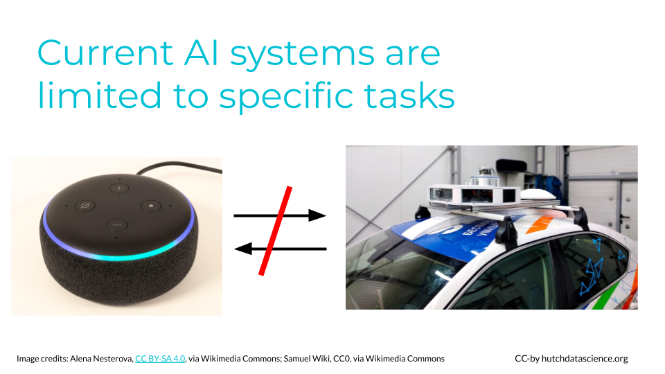

# VIDEO What Is AI

TODO: Slides here: https://docs.google.com/presentation/d/1-Mm-Vym3xdtB8xLRHR24jNCLSbNgFHw6N62iJrYe63c/edit#slide=id.g2a162964683_1_0

# What Is AI

When discussing artificial intelligence, people often envision humanoid robots, prompting concerns about their ability to outsmart us. The notion of robots passing tests that blur the line between human and machine, often depicted in science fiction, adds to these worries, particularly when considering the potential for AI systems to act in self-interest and make decisions independently.

Defining what AI is can be tricky because what experts consider to be AI changes frequently. John McCarthy, one of the leading early figures in AI once said, "As soon as it works, no one calls it artificial intelligence anymore". 

For instance, 20 years ago, the idea of an email spam checker was new. People were surprised that an algorithm could identify junk email accurately, and called it “artificial intelligence”. Since this type of algorithm has become so common, it is no longer called "artificial intelligence". This transition happened because we no longer think it is surprising that computers can filter spam messages. Because it is not learning something new and surprising, it is no longer considered intelligent. 

We often look at human intelligence the same way. For example, many years ago, only a few people knew how to use the internet. These people might have been considered extremely talented and intelligent. Now, the massive growth of online resources and social media mean that fluent internet use is almost required!

Scientists are still working toward computers with full human problem solving and cognition, or **artificial general intelligence**. We aren't there yet. Currently, artificial intelligence systems are optimized to perform a specific task well, but not for general, multi-purpose tasks. For example, the AI application for recognizing voices can not be directly applied to drive cars, and vice versa. Similarly, a language translation app could not recognize images, and vice versa.

 
**Artificial General Intelligence (AGI)**: A type of artificial intelligence that can understand, learn, and apply knowledge across a wide range of tasks, similar to the broad cognitive abilities of a human being. It represents the aspiration for machines to have versatile intelligence rather than focusing on specific, narrow domains. Check out **Types of AI** to learn more.

## Our AI Definition

Going forward in this course, we define AI as having the following features:

1. **Dataset**: AI needs data examples that can be used to train a statistical or machine learning model to make predictions.

1. **Algorithm**: AI needs an algorithm, or a set of procedures, that can be trained based on the data examples. That way, it can take a new example and execute a human-like task. For instance, the algorithm learns which images feature a cat from pre-labeled images. When given a new image, it decides whether the image has a cat in it. 

1. **Interface**: AI needs a physical interface or software for the trained algorithm to receive a data input and execute the human-like task in the real world. For example, you might interface with a chatbot in your web browser.

## AI In Practice

The following are case studies that can help us conceptualize AI in the real world.

### Amazon Recommendations

Amazon's recommendation engine uses AI algorithms to analyze user behavior and past purchases, providing personalized product recommendations. This enhances the shopping experience, increases customer engagement, and drives sales.

TODO: Text here.

### Financial Forecasting

TODO: Text here.

## What Is and Is Not AI

Let's look at a few of examples. We can then decide whether or not the examples constitute AI.

### Smartphones

The name "smartphone" implies these devices are making decisions and are powered by AI. Let's consider our three criteria:

1. **Dataset:** Smartphones do collect a lot of data. For example, they retain your text messages and collect motion tracking information.

1. **Algorithm:** The smartphone as a whole does not usually get trained with this data. However, some features like virtual voice assistants and facial recognition do adapt given your data.

1. **Interface**: Again, some features like voice assistants can be interacted with through the smartphone.

While there are some features on smartphones that are powered by AI models, like virtual voice assistants and facial recognition, the device as a whole isn't considered AI. 

### Calculators

Many of us use basic calculators, as you might find in Microsoft Excel, every day. AI also makes many calculations. Is it just a scaled-up calculator? 

1. **Dataset:** Calculators and spreadsheets can store data.

1. **Algorithm:** Calculators do not generally use this data to train algorithms. The procedures that are performed (addition, subtraction, etc.) are almost always predefined. However, some AI-powered assistants are starting to be integrated into software like Excel and Google Sheets.

1. **Interface**: Calculators do meet the criteria for an interface, whether through a physical device or software application.

Traditional calculators are not considered AI, because they can only execute predefined operations.

### Computer Programs

Like calculators, computers follow set procedures for problem solving and computation. Everyday computers use these procedures to help automate repetitive tasks and save time. However, this isn't generally considered AI, because the computer's algorithms aren't being trained with new data you supply. AI systems exhibit the ability to adapt and handle new inputs for tasks that might be more complicated. 

### DISCUSSION Is It AI

Consider the following examples. Are they examples of AI? Why or why not? Click to expand and see the answer.

  **A smartfridge that lets you know when replacement parts are needed**
 

This is not AI. The computer in the fridge is typically programmed to look for specific signs of wear or time passing. It is not typically trained with new data.

  **Speed cameras on the highway**
 

Speed cameras on highways typically use specialized technology and are not explicitly powered by AI. These cameras are often equipped with radar sensors for measuring vehicle speed between checkpoints.

While the core functionality of speed cameras relies on sensor technology and predetermined speed thresholds, AI elements may be incorporated in some advanced systems. For example, AI could be used to enhance image recognition accuracy for reading license plates. However, the fundamental operation of speed cameras is rooted in sensor-based speed detection, not AI.

  **Suggested accounts on Instagram**
 

This is considered AI. Social media algorithms, like Instagram's, make recommendations based on user behavior. For example, if you spend a lot of time viewing a page that was recommended, the system interprets that as positive feedback and will make similar recommendations. Typically, these recommendations get better over time as the user generates more user-specific data. You supply data through your behaviors, the algorithm gets trained, and you interact with the suggestions via the app.

