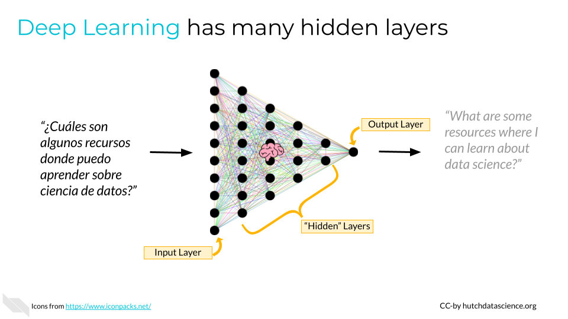

<!-- # VIDEO Different Types of AI -->

<!-- You can find the Google Slides for this video [here](https://docs.google.com/presentation/d/1UiYOR_4a68524XsCv-f950n_CfbyNJVez2KdAjq2ltU/edit?usp=sharing). -->

# Demystifying Types of AI

We've learned a bit about how AI works. However there are many different types of AI with different combinations of data, algorithms, and interfaces. There are also general terms that are important to know. Let's explore some of these below.

## Machine Learning 

**Machine learning** is broad concept describing how computers learn from looking at lots of examples. Imagine you are learning to tell the difference between apples and oranges. Someone first has to show you examples and say, "This is an apple, and this is an orange." Similarly, machine learning approaches need examples of input data that is "labeled" with the correct output. The goal of machine learning is making useful or accurate predictions. Machine learning includes simpler approaches like regression, and more complicated approaches like deep learning.

Below are a few examples of machine learning methods. 

### Neural Networks

**Neural networks** are a specific class of algorithms within machine learning. Neural networks mimic the way data is transferred between neurons in the brain.

Neural networks organize data into layers, starting with an "input layer" of raw data. Data is then transferred to the next layer, called a "hidden" layer. The hidden layer combines the raw data in many ways to create levels of abstraction. You can think of an image that is very pixelated becoming more clear. Finally, results are produced in an "output layer".

Neural networks often require large amounts of labeled data for training, and their performance may continue to improve with more data. [Google](https://about.google/) uses a neural network to power its search algorithm [@ibm2023]. Neural networks also do a pretty good job of recognizing human handwritten digits. 

### Deep Learning

**Deep learning** refers to neural networks with multiple intermediate "hidden" layers. A neural network with 2+ hidden layers could be considered a deep learning system [@ibm2023]. The advantage of deep learning is that these approaches cluster data automatically, and can detect abstraction or patterns that we might not know ahead of time. This is especially useful for complicated data, like unstructured text or images.

[Google Translate](https://translate.google.com/) has used deep learning to accurately translate text since 2016 [@Turner2016]. However, generative AI methods started being incorporated in the 2020s [@Gu2023].

Many of the machine learning approaches we're discussing here are **supervised learning** approaches. This means that data is labeled in predefined categories. An example could be "spam" or "not spam" labels attached to a data set of emails.

Sometimes, we are more interested in discovering variation, regardless of how we describe, or label, the data. This is called **unsupervised learning**. An example of this approach could be clustering human cells based on what kind of genes they have turned on. We don't know what type of cells they are necessarily, but can group them based on their behavior.

## Generative AI

Artificial Intelligence exploded in the early 2020s due to advancements in **Generative AI**, which includes text generation, image creation, natural speech generation, computer code production, biological molecule discovery, simulated data, and more. Let's break down some of the following terms related to generative AI.

### Transformer Models and Architecture

In 2017, Google engineers published a paper, "Attention is all you need", describing a type of neural network they called a **transformer** [@vaswani2017]. Transformer architecture has revolutionized the field of natural language processing and led to an explosion in what was possible with AI. Transformers are a key feature of what drives generative AI models today, and have allowed huge leaps forward in language understanding and image processing [@tay2022efficient]. 

The transformer architecture uses something called **self-attention** to figure out how important different parts of a sentence are when making predictions. This helps the model understand how words relate to each other in a sentence, regardless of their order in the sentence. 

Do we say transformer model or transformer architecture? Transformer architecture refers to the overall design, or "transformers" generally speaking. We use the term "transformer model" when dealing with a specific example, such as the GPT (Generative Pre-trained Transformer) model.

### Large Language Model

Large Language Models (LLMs) are a specific type of generative AI model, often built using the transformer architecture, that leverage a huge volume of language data. Examples include models like OpenAI's GPT (Generative Pre-trained Transformer) series. LLMs are trained on extensive text datasets and can generate coherent and contextually relevant text passages. You might be very familiar with LLMs, as they include super popular tools like [ChatGPT](https://chat.openai.com/), [Bard](https://bard.google.com/chat), [Claude Instant](https://poe.com/Claude-instant), and [Llama](https://ai.meta.com/llama/). 

The process of interpreting a user prompt for a GPT model might go as follows:

1. A user provides a prompt, such as "Describe a nice vacation for winter time."

1. The encoder translates words into machine-relevant values such as numerical vectors. It also captures semantic relationships.

1. The transformer weighs different parts of the input for better understanding.

1. The hidden layers of the neural network further decipher complex patterns and representations.

1. Decoders generate the output that the user sees.

### Diffusion Model

Diffusion models are a type of **deep generative model**. They are particularly powerful when it comes to image generation, but can also be used for other generative AI applications, like video generation and molecule design [@yang2023]. The approach behind diffusion models is that they add more and more random noise to images (the "diffusion" process). Noise is then removed to generate the most "likely" novel outputs. The key feature of these models is the denoising process.

A very popular diffusion model is used by [Stable Diffusion](https://stability.ai/) for real-time text-to-image generation.

### Variational Autoencoders (VAEs)

Variational autoencoders are a type of **deep generative model**. Variational autoencoders emerged slightly earlier than diffusion models [@kingma2013]. Like diffusion models, they work with data that is noisy and not perfect. Variational autoencoders are trained and generate outputs differently, however. They detect essential features or patterns within inputs and condense them in a more concise and abstract form. This differs from diffusion models, which focus on the process of cleaning up noisy data to make it look like new images, text, etc.

### Generative Adversarial Networks (GANs)

Generative adversarial networks are a type of **deep generative model**. While the end goals are similar (new generated content), GANs differ in their training and objective. Generative Adversarial Networks work like two computers competing with each other. The first component, the "generator", creates data, while the second, the "discriminator", determines if the sample is realistic. Imagine two professionals, one artist specializing in artwork forgery, and one a detective specializing in forgery detection. If they are constantly competing, they will both get better at their respective specialty!

The website *This Person Does Not Exist* (https://thispersondoesnotexist.com/) creates photorealistic headshots of imaginary people using a GAN called StyleGAN2 [@karras2020].

## Natural Language Processing

**Natural language processing**, or NLP, deals with interpreting text and extracting relevant information and insights. It is a field of study rather than a type of algorithm. Typically, these systems look at huge volumes of text data to understand the relationship among words, parts of words, or sentences.

Natural language processing can also categorize and organize the documents themselves. For example, NLP could help read the contents of documents online and decide whether they are patents or journal articles. These documents could then be indexed in [Google Scholar](https://scholar.google.com/). 

Initially, NLP was accelerated by techniques such as word vectorization [@odsc2023]. In short, this makes it easier for computers to understand that the words "apple" and "orange" (both fruits) are more closely related than "apple" and "planet" (perhaps both round, but that's less important). Many NLP approaches also use deep learning [@wikiNLP]. Increasingly, generative AI is part of natural language processing [@odsc2023].

Natural language processing has been used to summarize the abundance of text information available in electronic health records. For example, healthcare practitioners showed that detecting evidence and information in records could improve treatment and quality of care for patients with diabetes [@turchin2021]. 

## Strengths and Weaknesses

Here is a summary of some strengths and weaknesses of different concepts in AI. These are handy to keep in mind as you are making decisions about what kind of AI to use in your workplace.

<table class="striped">
 <thead>
  <tr>
   <th style="text-align:left;">   </th>
   <th style="text-align:right;"> Strengths </th>
   <th style="text-align:right;"> Challenges </th>
  </tr>
 </thead>
<tbody>
  <tr>
   <td style="text-align:left;"> Machine Learning </td>
   <td style="text-align:right;"> 
      Makes accurate predictions based on learning from labeled examples; includes a large variety of approaches, including computationally cheap ones
   </td>
   <td style="text-align:right;"> 
      Extensive volumes of labeled data might be needed
   </td>
  </tr>
  <tr>
   <td style="text-align:left;"> Neural Networks </td>
   <td style="text-align:right;"> 
      Great for recognizing intricate patterns in data; automatically discovers important features in data
   </td>
   <td style="text-align:right;"> 
      Require large datasets; can be computationally intensive   
   </td>
  </tr>
  <tr>
   <td style="text-align:left;"> Deep Learning </td>
   <td style="text-align:right;"> 
      Captures complex representations of data, enhancing performance in tasks like image and speech recognition     </td>
   <td style="text-align:right;"> 
      Require large datasets; computationally intensive; difficult for humans to interpret reasoning behind outputs ("black box"), which raises ethical concerns
   </td>
  </tr>
  <tr>
   <td style="text-align:left;"> Transformer and Large Language Models </td>
   <td style="text-align:right;"> 
      Self-attention mechanism enables understanding of context efficiently, pivotal for language understanding and generation
   </td>
   <td style="text-align:right;"> 
      Very computationally intensive; difficult for humans to interpret reasoning behind outputs ("black box") 
   </td>
  </tr>
  <tr>
   <td style="text-align:left;"> Diffusion Models </td>
   <td style="text-align:right;"> 
      Great for image generation due to the denoising score matching approach.
   </td>
   <td style="text-align:right;"> 
      Very computationally intensive; might only work well for a specific task (e.g., image generation)
   </td>
  </tr>
</tbody>  
</table>

## Summary

Neural Networks and Deep Neural Network Learning are both key components of today’s AI. They function like human brains for advanced pattern recognition. Deep Neural Networks are a critical component of generative AI.

Transformer architecture is central to many of today’s Large Language Models and allows for rapid processing of context in text.

Diffusion models adjust noise to generate new content, such as images.

 

**Disclaimer:** The thoughts and ideas presented in this course are not to be substituted for legal or ethical advice and are only meant to give you a starting point for gathering information about AI policy and regulations to consider.

# DISCUSSION AI Types

1. Discuss some of the strengths and weaknesses of different AI techniques covered in the chapter. When might certain approaches be preferable over others given the available data or task?

1. Reflect on the different definitions and terminology covered regarding AI types. What stood out to you? What questions do you still have?

 

**Disclaimer:** The thoughts and ideas presented in this course are not to be substituted for legal or ethical advice and are only meant to give you a starting point for gathering information about AI policy and regulations to consider.

