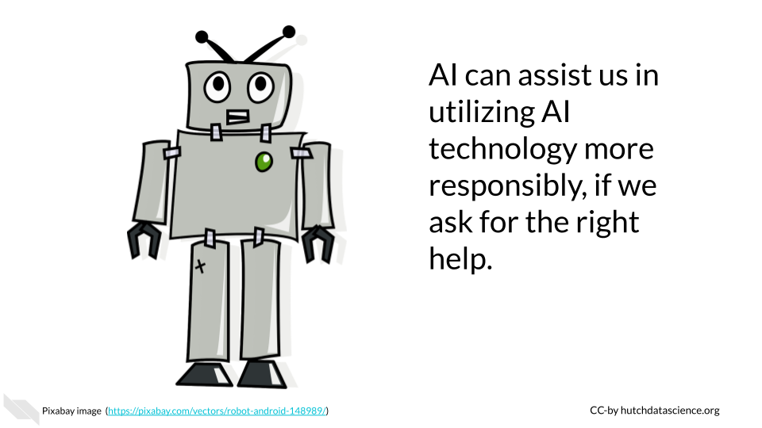

## Algorithm considerations

In this chapter we will discuss the some of the major ethical considerations for the use or development of AI tools.

1) **Toxic Responses** - Currently it is not clear how well generative AI models restrict harmful responses in terms of ideas, code, text, etc. 
1) **Lack of Interpretability** - When complicated algorithms are used within AI systems, it can be unclear how it came up with a decision. In many circumstances it is necessary to understand how the AI system works to know how to proceed. 
1) **Misinformation and Faulty Responses** - Fake or manipulated data used to help design algorithms could be believed to be correct and this could be further propagated. Text, code, etc. provided to users may not be correct or optimal for a given situation, and may have at times severe downstream consequences.
1) **Security or Privacy Issues** - Uploading, pasting or typing in proprietary or private data, code, text, images or other files into commercial generative AI tools may be leaked not only to the developers of the commercial tool, but potentially also to other users

Note that this is an incomplete list; additional ethical concerns will become apparent as we continue to use these new technologies. We highly suggest that users of these tools **careful to learn more about the specific tools they are interested in** and to be **transparent** about the use of these tools, so that as new ethical issues emerge, we will be better prepared to understand the implications.

## Harmful or Toxic Responses

Another major concern is the use of AI to generate malicious content or that AI itself may accidentally create harmful responses. For instance, AI could start suggesting the creation of code that spreads malware or hacks into computer systems. Another issue is what is called ["toxicity"](https://towardsdatascience.com/toxicity-in-ai-text-generation-9e9d9646e68f), which refers to disrespectful, rude, or hateful responses (@nikulski_toxicity_2021). These responses can have very negative consequences for users. Ultimately both issues could cause severe damage to individuals and organizations, including data breaches and financial losses. AI systems need to be designed with safeguards to avoid harmful responses, to test for such responses, and to ensure that the system is not infiltrated by additional possibly harmful parties.

### Tips for avoiding the creation of harmful content

* Be careful about what commercial tools you employ, they should be transparent about what they do to avoid harm.
* If designing a system, ensure that best practices are employed to avoid harmful responses. This should be done during the design process and should the system should also be regularly evaluated. Some development systems such as [Amazon Bedrock](https://aws.amazon.com/blogs/aws/evaluate-compare-and-select-the-best-foundation-models-for-your-use-case-in-amazon-bedrock-preview/) have tools for evaluating [toxicity](https://towardsdatascience.com/toxicity-in-ai-text-generation-9e9d9646e68f) to test for harmful responses. Although such systems can be helpful to automatically test, evaluation should also be done directly by humans.
* Be careful about the context in which you might have people use AI - will they know how to use it responsibly?
* Be careful about what content you share publicly, as it could be used for malicious purposes.
* Consider how the content might be used by others.
* Ask the AI tools to help you, but do not rely on them alone.

What are the possible downstream uses of this content?

What are some possible negative consequences of using this content?

## Lack of Interpretability

There is risk in using AI tools, that we may encounter situations where it is unclear why the AI system came to a particular result. AI systems that use more complicated algorithms can make it difficult to trace back the decision process of the algorithm. 
Using content created or modified by AI, could make it difficult for others to understand  if the content is adequate or appropriate, or to identify and fix any issues that may arise. 

This could result in negative consequences, such as for example reliance on a system that distinguishes consumers or patients based on an arbitrary factor that is actually not consequential. Decisions based on AI responses therefore need to be made extra carefully and with clarity about why the AI system may be indicating various trends or predictions. 

### Tips for avoiding a lack of interpretability

 * Content should be reviewed by those experienced in the given field.
 * Ask AI tools to help you understand the how it got to the response that it did, but get expert assistance where needed.
 
:::{.query}
Can you explain how you generated this response?
:::
## Misinformation and Faulty Responses

AI tools use data that may contain false or incorrect information and may therefore respond with content that is also false or incorrect. 

This is due to number of reasons:

- AI tools may "hallucinate" fake response based on artifacts of the algorithm
- AI tools may be trained on data that is out-of-date
- AI tools may be trained on data that has fake or incorrect information
- AI tools are not necessarily trained for every intended use and may therefore may not reflect best practices for a given task or field

AI tools may also report data as if it is real, when it is in fact not real. For example, currently at the time of the writing of this course, ChatGPT will report citations with links that are not always correct. Furthermore, AI models can "hallucinate" incorrect responses based on artifacts of the algorithm underneath the tool. These responses are essentially made up by the tool. It is difficult to know when a tool is hallucinating especially if it is a tool that you did not create, therefore it is important to review and check responses from AI tools. There is also a risk that content written with AI tools, may be incorrect or inappropriate for the given context of intended use, or they may not reflect best practices for a given context or field. The tools are limited to the data they were trained on, which may not reflect your intended use.

It is also important to remember that content generated by AI tools is not necessarily better than content written by humans. It requires just as much, if not more review. 

### Tips for reducing misinformation & faulty responses

* Be aware that some AI tools currently make up false information based on artifacts of the algorithm called hallucinations or based on false information in the training data. 
* Do not assume that the content generated by AI is real or correct.
* Realize that AI is only as good or up-to-date as what it was trained on, the content may be generated using out-of-date data. Look up responses to ensure it is up-to-date.
* In many cases **utilizing multiple AI tools** can help you to **cross-check** the responses (however be careful about the privacy of each tool if you use any private or propriety data in your prompts!).
* Ask the AI tools for extra information about if there are any potential limitations or weaknesses in the responses, but keep in mind that the tool may not be aware of issues and therefore human review is required. The information provided by the tool can however be a helpful starting point.

:::{.query}
Are there any limitations associated with this response?
:::

:::{.query}
What assumptions were made in creating this content?
:::

:::{.ethics}
[Stack Overflow](https://stackoverflow.com/), a popular community-based website where programmers help one another, has (at the time of writing this) temporarily [banned](https://meta.stackoverflow.com/questions/421831/temporary-policy-chatgpt-is-banned) users from answering questions with AI-generated code. This is because users were posting incorrect answers to questions. It is important to follow this policy (as you may face removal from the community). This policy goes to show that you really need to check the code that you get from AI models. While they are currently helpful tools, they do not know everything. 
:::

## Lack of Interpretability

There is risk in using AI tools, that we may encounter situations where it is unclear why the AI system came to a particular result. AI systems that use more complicated algorithms can make it difficult to trace back the decision process of the algorithm. 
Using content created or modified by AI, could make it difficult for others to understand  if the content is adequate or appropriate, or to identify and fix any issues that may arise. 

This could result in negative consequences, such as for example reliance on a system that distinguishes consumers or patients based on an arbitrary factor that is actually not consequential. Decisions based on AI responses therefore need to be made extra carefully and with clarity about why the AI system may be indicating various trends or predictions. 

### Tips for avoiding a lack of interpretability

 * Content should be reviewed by those experienced in the given field.
 * Ask AI tools to help you understand the how it got to the response that it did, but get expert assistance where needed.
 
:::{.query}
Can you explain how you generated this response?
:::
 

## Misinformation and Faulty Responses

AI tools use data that may contain false or incorrect information and may therefore respond with content that is also false or incorrect. 

This is due to number of reasons:

- AI tools may "hallucinate" fake response based on artifacts of the algorithm
- AI tools may be trained on data that is out-of-date
- AI tools may be trained on data that has fake or incorrect information
- AI tools are not necessarily trained for every intended use and may therefore may not reflect best practices for a given task or field

AI tools may also report data as if it is real, when it is in fact not real. For example, currently at the time of the writing of this course, ChatGPT will report citations with links that are not always correct. Furthermore, AI models can "hallucinate" incorrect responses based on artifacts of the algorithm underneath the tool. These responses are essentially made up by the tool. It is difficult to know when a tool is hallucinating especially if it is a tool that you did not create, therefore it is important to review and check responses from AI tools. There is also a risk that content written with AI tools, may be incorrect or inappropriate for the given context of intended use, or they may not reflect best practices for a given context or field. The tools are limited to the data they were trained on, which may not reflect your intended use.

It is also important to remember that content generated by AI tools is not necessarily better than content written by humans. It requires just as much, if not more review. 

### Tips for reducing misinformation & faulty responses

* Be aware that some AI tools currently make up false information based on artifacts of the algorithm called hallucinations or based on false information in the training data. 
* Do not assume that the content generated by AI is real or correct.
* Realize that AI is only as good or up-to-date as what it was trained on, the content may be generated using out-of-date data. Look up responses to ensure it is up-to-date.
* In many cases **utilizing multiple AI tools** can help you to **cross-check** the responses (however be careful about the privacy of each tool if you use any private or propriety data in your prompts!).
* Ask the AI tools for extra information about if there are any potential limitations or weaknesses in the responses, but keep in mind that the tool may not be aware of issues and therefore human review is required. The information provided by the tool can however be a helpful starting point.

:::{.query}
Are there any limitations associated with this response?
:::

:::{.query}
What assumptions were made in creating this content?
:::

:::{.ethics}
[Stack Overflow](https://stackoverflow.com/), a popular community-based website where programmers help one another, has (at the time of writing this) temporarily [banned](https://meta.stackoverflow.com/questions/421831/temporary-policy-chatgpt-is-banned) users from answering questions with AI-generated code. This is because users were posting incorrect answers to questions. It is important to follow this policy (as you may face removal from the community). This policy goes to show that you really need to check the code that you get from AI models. While they are currently helpful tools, they do not know everything. 
:::

 

## Security and Privacy issues

Commercial AI tools are often not designed to protect users from unknowingly submitting prompts that include propriety are private information. Different AI tools have different practices in terms of how they do or do not collect data about the prompts that people submit. They also have different practices in terms of if they reuse information from prompts to other users. Thus if users submit prompts that include propriety or private information, they run the risk of that information being viewable not only by the developers/maintainers of the AI tool used, but also by other users who use that same AI tool. Note that the AI system itself may not be trained on responses for how prompt data is collected or not. 

Furthermore, AI tools are not always trained in a way that is particularly conscious of data security. If for example, code is written using these tools by users who are less familiar with coding security concerns, protected data or important passwords may be leaked within the code itself. AI systems may also utilize data that was actually intended to be private. 

It is also important to consider what data your the responses that you get from an AI tool might actually be using.

### Tips for reducing security and privacy issues

* Check that no sensitive data, such as Personal Identifiable Information (PII) or propriety information becomes public through prompts to commercial AI systems.
* Consider purchasing a license for a private AI system if needed or create your own if you wish to work with sensitive data (seek expert guidance to determine if the AI systems are secure enough).
* Promote for regulation of AI tools by voting for standards where possible.
* Ask AI tools for help with security when using commercial tools, but to not rely on them alone. In some cases, commercial AI tools will even provide little guidance about who developed the tool and what data it was trained on, regardless of what happens to the prompts and if they are collected and maintained in a secure way.
* Consult with an expert about data security if you want to design or use a AI tool that will regularly use private or propriety data.

Are there any possible data security or privacy issues associated with the plan you proposed?

## Violating Copyright

When AI systems are trained on data, they may also learn and incorporate copyrighted information. This means that AI-generated content could potentially infringe on the copyright of the original author. For example, if an AI system is trained on a code written by a human programmer, the AI system could generate code that is identical to or similar to the code from that author. If the AI system then uses this code without permission from the original author, this could constitute copyright infringement.

Similarly, AI systems could potentially infringe on intellectual property rights by using code that is protected by trademarks or patents. For example, if an AI system is trained on a training manual that contains code that is protected by a trademark, the AI system could generate code that is identical to or similar to the code in the training manual. If the AI system then uses this code without permission from the trademark owner, this could constitute trademark infringement.

### Tips for avoiding copyright violations

* Be transparent about what AI tools you use to write your code. 
* Obtain permission from the copyright holders of any content that you use to train an AI system. Only use content that has been licensed for use.
* Cite all content that you can.
* Ask the AI tools if the content it helped generate used any content that you can cite.

Did this content use any content from others that I can cite?

## Summary

Here is a summary of all the tips we suggested:

:::{.ethics}

* Disclose when you use AI tools to create content.
* Be aware that AI systems are biased and their responses are likely biased. Any content generated by an AI system should be evaluated for potential bias.
* Be aware that AI systems may behave in unexpected ways. Implement new AI solutions slowly to account for the unexpected. Test those systems and try to better understand how they work in different contexts.
* Be aware that humans are still better at generalizing concepts to other contexts.
* Carefully consider if an AI solution is appropriate for your context.
* Credit human authors by citing them and adhering to copyright restrictions.
* Ensure that prompts to commercial tools don't include private or propriety data or information.
* Cross-check content from AI tools by using multiple AI tools - but check that each tool meets the privacy and security restrictions that you need.
* Don't assume AI-generated content is real, accurate, consistent, current, or better than that of a human.
* Ask the AI tools to help you understand:
  * Sources for the content that you can cite
  * Any decision processes in how the content was created 
  * Potential limitations 
  * Potential security or privacy issues
  * Potential downstream consequences of the use of the content
* Always have expert humans review the content and value your own contributions and thoughts.
* Emphasize training and education about AI and recognize that best practices will evolve as the technology evolves.

:::

Overall, we hope that these guidelines and tips will help us all use AI tools more responsibly. We recognize however, that as this is emerging technology and more ethical issues will emerge as we continue to use these tools in new ways. AI tools can even help us to use them more responsibly when we ask the right additional questions, but remember that human review is always necessary. Staying up-to-date on the current ethical considerations will also help us all continue to use AI responsibly.

