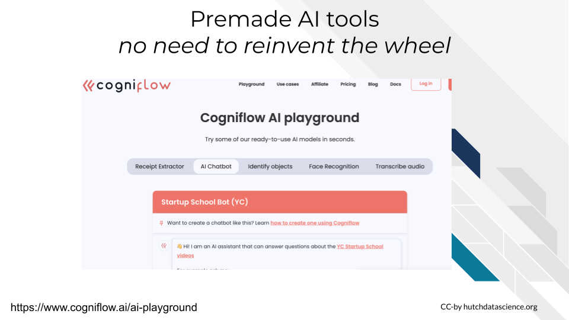
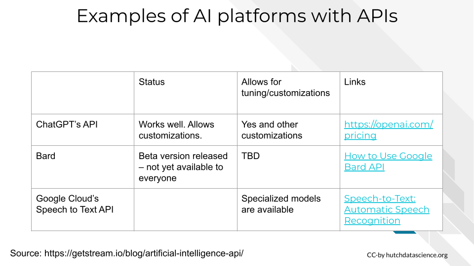

# VIDEO: Customized Interface for AI

This video discusses how to address custom interface needs for an AI tool.

<!-- <iframe width="560" height="315" src="https://www.youtube-nocookie.com/embed/ID" title="YouTube video player" frameborder="0" allow="accelerometer; autoplay; clipboard-write; encrypted-media; gyroscope; picture-in-picture" allowfullscreen></iframe> --> 

You can view and download the Google Slides [here](https://docs.google.com/presentation/d/1qrR_FHMrYr4ZUgghC5FE4sJ107uv7QPisyGPTPI4I1g/edit).

# Customized Interfaces for AI

## Learning objectives:

- Understand the motivation behind customized interfaces needs for AI tools
- Discuss a variety of low to high investment strategies for meeting customized interface needs
- Define and be able to contrast the differences graphics user interfaces and command line interfaces.

## Intro

Sometimes you need the power of AI underneath the hood of your own website/app. There are multiple strategies you can employ to achieve this.

In this scenario, you need to have your website or app that has its own interface. Interfaces are how people will use your app. There's two main interface types that are most common: GUIs and Command line

- `GUI` - stands for "Graphics user interface" -- it's the most widely used. Here users point and click buttons to tell a computer and its software what they'd like to do.
- `Command line` - generally for software that is for individuals with more technical expertise and comfort with programming. In this interface, users type commands in order to perform tasks

In this scenario we could maintain all of the same machinery but merely have a different platform where our users arrive.

## General strategies for custom interfaces

There are multiple strategies for empowering your website or app with an AI model or tool. These are arranged in order from lowest to highest investment.

- Embed premade AI tools in your app - There are prepackaged solutions for standard AI tools that you might want for your website. These are subscription services but require minimal expertise to employ.
- Use an API (Application programming interface) underneath the hood of your app -- an increasing number of LLMs and other AI tools have APIs available. APIs allow one to access a website or tool programmatically. This means that you can build your tool in such a way that underneath the hood it is powered by an AI tool.
- Deploy existing model in your own app - this is the most technically intensive solution but would be necessary if you require other types of customizations for your AI tool.

Usability experts are going to be really helpful for carrying out this kind of need. Interface designs can make or break a tool’s usability and hence popularity!

## Examples of AI customized interface strategies

## Premade AI tools

Some services like [Cogniflow](https://www.cogniflow.ai/ai-playground) offer prepackaged AI services like chatbots that you can embed in your website or tool. This has the advantage of being minimal maintenance or software development knowledge needed. But as always, you generally don't have the ability to highly customize or finely tune these types of options. They generally are subscription services or pay for what you use.

## AI tool APIs

Pre-package tools may only have certain options…

In contrast, APIs can be very powerful and allow you to incorporate all the power of an AI tool into your website/app. They also free you team from having to do as much back end development. Although not all AI tools have API access, an increasing number of them are developing this as an option.

Currently [ChatGPT's API](https://openai.com/pricing) is the most well developed for LLM (it appears at the time of writing this) but of course it requires a higher cost subscription plan. [Bard may have a beta version of their API](https://medium.com/@novita_ai/how-to-use-google-bard-api-57a14d95bfa3) being further developed and released. Other types of AI models (not LLMs) often have API access as well like [Google Cloud's speech to text API](https://cloud.google.com/speech-to-text).

## Custom builds

If you need more than a custom interface but also custom knowledge, security you, or handling you will likely need to build custom AI solutions – again this requires more staff expertise

In the next chapter we will discuss custom AI builds.
