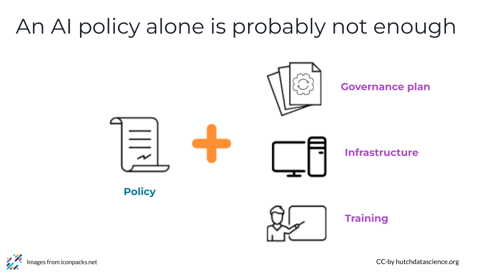
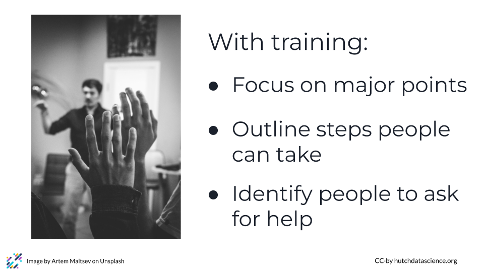

# Considerations for creating an AI Policy

How you create an AI policy, as well as what you cover in it, is going to be highly dependent on what your organization's needs are. Unfortunately, there is no "one size fits all" approach to AI policies, governance, and training. However, we can offer some considerations based on our experiences creating and implementing policies.

**Disclaimer:** The thoughts and ideas presented in this course are not to be substituted for legal or ethical advice and are only meant to give you a starting point for gathering information about AI policy and regulations to consider.

## An AI policy alone is not enough

It is probably not enough to build only an AI policy. Building an AI support system that makes it possible for the people in your organization to adopt AI in safe and ethical ways is also important. An AI policy support system might include a governance plan describing how new AI use cases will be reviewed and guidance for implementation provided, a clear understanding of the necessary components of your infrastructure to plan to use AI tools on, and training materials that include specific best practices for different types of AI tools and use cases.

Thinking about your AI policy as just the beginning, not the entire thing, can be a way to protect your employees, your organization, and the people you serve.

## Get lots of voices weighing in from the beginning

AI systems are being integrated into every aspect of the work environment.  Sometimes these tools are very obvious such as when an AI tool is applied to your data to do predictive work. Other times they are less obvious such as when they are integrated into common desktop software as co-pilots or “auto-fill”. You likely need a lot of different people with different perspectives to weigh in to get even close to what you want in terms of a comprehensive AI policy. Limiting policy and governance plan creation to just the Chief Data Officer’s office or the IT department or the legal department might make things faster, but the trade-off is that you are likely only covering a fraction of what you need. At minimum, most organizations probably need representatives from legal, compliance and governance, IT , offices of diversity, equity, inclusion, ethical review, and training. 

Creating a meaningful policy and getting the necessary supports put in place is easier when you have people with varied and broad expertise creating the policy from the beginning.

## Consider how to keep your guidance agile

The speed at which AI technology is changing is fast enough that creating useful guidelines around its use is difficult. An AI policy requires you to get a diverse set of opinions together and make it cohesive and coherent, and that takes time. The last thing you want to do is create a policy that no longer applies in 3 months when AI systems have changed again.

One possible approach is to think of your AI Policy as an ongoing living document as opposed to a one time effort. Another way includes creating both an AI Policy and an AI Best Practices document, where the policy changes infrequently while the best practices evolves more quickly. For example, the policy document might say something like “you should use infrastructure that matches current best practices.” This allows you to create a policy that is still useful over time as your organization learns what AI practices and infrastructure is best for it. This still requires you to communicate frequently with your employees on the state of the best practices for AI use. However, the best practices can be tailored to fit specific departments and change as those departments need it to do so. This also allows an organization to communicate to specific departments and employees who might be affected by an update to their best practices guidelines.

However you choose to do it, systematize the process of creating your policy so that you can easily update it when necessary

## Make it easy for people to follow your policy through effective training

Good AI policies are most effective when they are easy for people to follow. This can be particularly challenging in periods of explosive technological growth like we’re experiencing now with AI. What is possible with AI, and how to safely and ethically use AI, is changing quickly, making it a challenge for people to always know how to comply with an AI policy. This is an opportunity to make your AI governance plan include specific points about communication, training and guidance so users have regular updates from the governance group that enable them to use AI tools ethically and securely. 

In situations like these, one way to approach training is to focus on major points people should consider, clearly outline the steps people can take to do the right thing, and identify who people can approach when they have questions. Many people may not solidly know the answers to all questions, but the right people can help you find the answer. Training people how to loop in the proper people, and to ask for help from the very beginning, might save them stress later.

# VIDEO Considerations for creating an AI Policy
